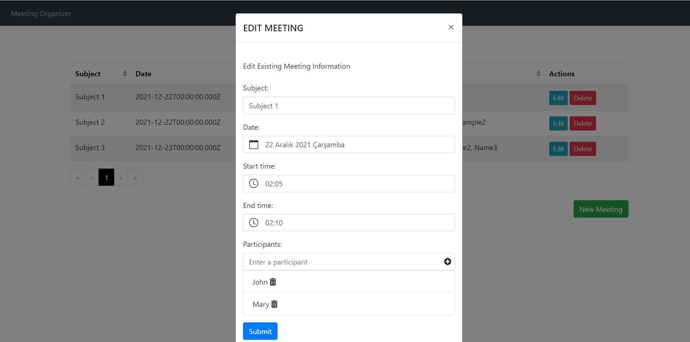

# Meeting Organizer (VueJs & NodeJS)

# [Live Demo](https://meeting-organizer.netlify.app/)

## Content of Project

- It is a Fullstack Vue.js and NodeJs Application that records the meeting dates and times.

- Data such as participants, meeting date information can be edited and deleted.

### Build With

- HTML
- CSS
- [VueJs](https://vuejs.org/)
- [BootstrapVue](https://bootstrap-vue.org/)
- [NodeJs](https://nodejs.org/)
- [ExpressJs](https://expressjs.com/)
- [MongoDB](https://www.mongodb.com/)